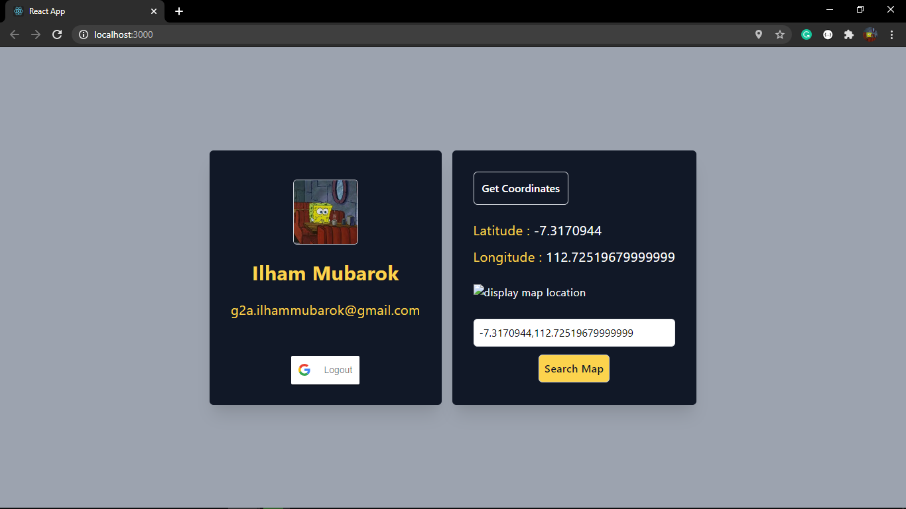

# Implementation Sign-In with Google API and Geocoding

This project shows how to use Sign-In with Google API and display the information about signed account. Also ask for location access to get user latitude and longitude then show the static map.

This project was bootstrapped with [Create React App](https://github.com/facebook/create-react-app).

## Available Scripts

In the project directory, you can run:

### `npm start`

Runs the app in the development mode.\
Open [http://localhost:3000](http://localhost:3000) to view it in the browser.

The page will reload if you make edits.\
You will also see any lint errors in the console.

## Resources

- [Integrating Google Sign-In for Websites](https://developers.google.com/identity/sign-in/web/sign-in)
- [Reverse Geocoding](https://developers.google.com/maps/documentation/javascript/examples/geocoding-reverse)
- [Install Tailwind CSS with Create React App](https://tailwindcss.com/docs/guides/create-react-app)
- [React Google Login via NPM](https://www.npmjs.com/package/react-google-login)

To learn React, check out the [React documentation](https://reactjs.org/).
